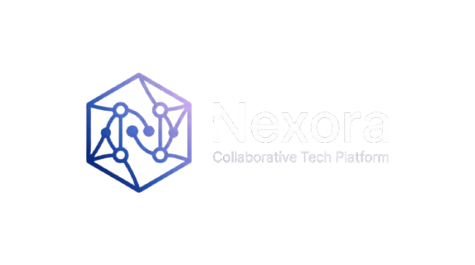

working demo is live : https://nexora-ylt5.onrender.com

# Nexora — Multi-user Classroom

Nexora is a premium, real-time collaboration platform designed for modern classrooms. It combines live video, interactive quizzes, shared whiteboarding, and an AI assistant into a seamless, dark-themed experience.



## 🚀 Key Features

- **Live Video & Screen Sharing**: High-quality WebRTC mesh networking for up to 12 participants.
- **Interactive Quiz Builder**: Teachers can create and launch real-time quizzes with live leaderboards and scoring.
- **Shared Whiteboard**: A collaborative canvas with drawing tools (Pen, Shapes, Eraser) synced across all participants.
- **AI Study Assistant**: Integrated AI (via OpenRouter) to answer questions and assist in learning sessions.
- **Real-time Chat**: Group messaging with built-in profanity filtering and role-based badges.
- **Teacher Controls**: Room locking, participant management (kick/mute), and session control.
- **Premium UI**: Modern dark aesthetic with "rainbow" glow effects and responsive design.

## 🛠️ Tech Stack

### Frontend
- **Languages**: HTML5, Vanilla CSS3, Javascript (ES6+)
- **Real-time**: [Socket.io-client](https://socket.io/)
- **Styling**: Custom CSS variables, Glassmorphism, Dynamic animations.

### Backend
- **Runtime**: [Node.js](https://nodejs.org/)
- **Framework**: [Express.js](https://expressjs.com/)
- **Communication**: [Socket.io](https://socket.io/)
- **AI Integration**: OpenAI SDK (configured for OpenRouter)
- **Utilities**: Axios (API requests), Dotenv (Configuration), Multer (File Handling).

## ⚙️ Installation & Setup

1. **Clone the repository**:
   ```bash
   git clone <repository-url>
   cd nexora-main
   ```

2. **Install dependencies**:
   ```bash
   npm install
   ```

3. **Configure Environment Variables**:
   Create a `.env` file in the root directory and add your API keys:
   ```env
   PORT=3000
   OPENROUTER_API_KEY=your_openrouter_key
   CARTESIA_API_KEY=your_cartesia_key
   CARTESIA_VOICE_ID=your_voice_id
   ```

4. **Start the server**:
   ```bash
   # Production
   npm start
   
   # Development (with nodemon)
   npm run dev
   ```

## 📖 Usage Guide

1.  **Join the Session**: Enter your name and a Room ID on the lobby screen.
2.  **Teacher Role**: The first person to join a room is automatically promoted to Teacher and gains control over the whiteboard and quizzes.
3.  **Collaborate**: Use the sidebar to switch between Video Grid, Chat, Quiz, and the AI Assistant.
4.  **Whiteboard**: Click the "Board" button in the control bar to start drawing (Teacher only).

## 🤝 Contributing

Contributions are what make the open-source community such an amazing place to learn, inspire, and create. Any contributions you make are **greatly appreciated**.

1. Fork the Project
2. Create your Feature Branch (`git checkout -b feature/AmazingFeature`)
3. Commit your Changes (`git commit -m 'Add some AmazingFeature'`)
4. Push to the Branch (`git push origin feature/AmazingFeature`)
5. Open a Pull Request

## 📄 License

Distributed under the MIT License. See `LICENSE` for more information.

---
Built with ❤️ by [toodos](https://github.com/toodos)
